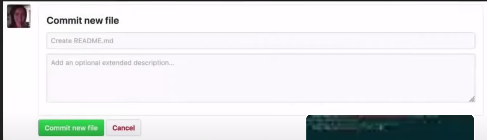

# Countdown_timer for Problem solving strategy
##Django and Python
a countdown timer as a web terminal which will give 20 mins to analyze the problem and code, if it was not done in 20 mins then it will kepp adding 20 mins untill the problem has been finished(maximum 2 times)
if not done by that time, it will add 10 mins to copy the code to integrate in self code
 ##git commands
 ls -la (to show all the files)
 git status 
 git add . to track all the files in the folder
 git add folder_name
 git commit -m "update readme.md" -m "added the main git commands"

